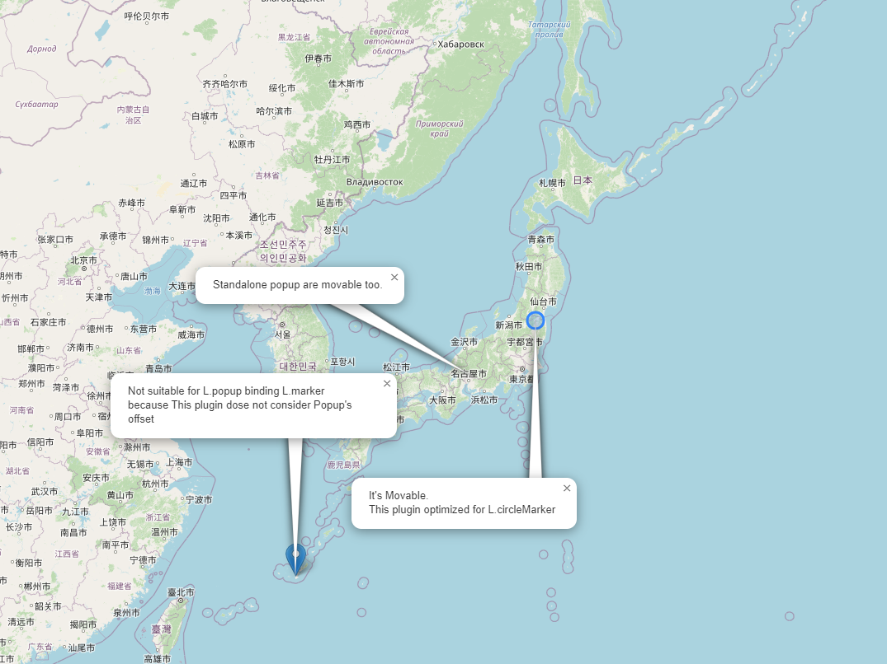

# leaflet-popupmovable
Make Leaflet's L.Popup movable and draw leadline.

[demo](https://wrwrh.github.io/leaflet-popupmovable/Demo/index.html)


### Usage
1. include the plugin file.
```
<script src="Leaflet.PopupMovable.js"></script>
```
2. Initialize plugin's class.
```
<script>
  new PopupMovable(your-L.Map);
</script>
```
### License
This code is provided under the MIT license.
