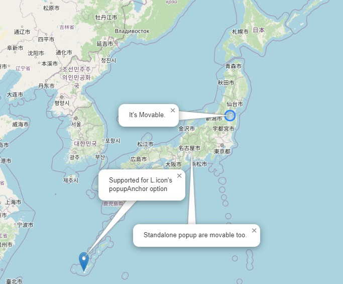

# Leaflet-PopupMovable
Make Leaflet's L.Popup movable(draggable) and draw leadline.

[demo](https://wrwrh.github.io/leaflet-popupmovable/Demo/index.html)



## Usage
1. include the plugin file.
```
<script src="Leaflet.PopupMovable.js"></script>
```
2. Initialize plugin's class.
```
<script>
  new PopupMovable(your-L.Map);
</script>
```
3. (Recommended)Disable autoclode option of L.Popup.
```
var popup = new L.Popup({autoClose:false});
```

## License
This code is provided under the MIT license.
