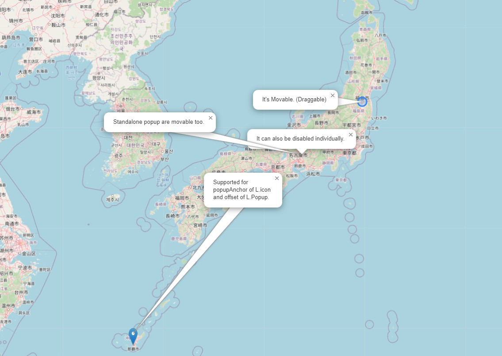

# Leaflet-PopupMovable
Leafletのポップアップ(L.popup)をドラッグ可能にし、ドラッグ時に自動で引出線を描画するプラグインです。

[demo](https://wrwrh.github.io/leaflet-popupmovable/Demo/index.html)



## 使用方法
1. このプラグインファイルを対象HTMLファイルに組み込みます。
```
<script src="Leaflet.PopupMovable.js"></script>
```
2. L.mapオブジェクト作成時のオプションで、'popupMovable'を'true'にします。
```
<script>
  var map = new L.map('MapContainer', {
    //このプラグインを有効にするため、trueをセットします。
    popupMovable: true,
    //ズーム時のポップアップの位置を算出する方法を指定します。
    popupMovableZoomMode: 'relative', // デフォルト値は'relative'です。
    //このオプションには以下の値を指定できます。
    //'relative' マーカーとポップアップの位置関係を保持します。
    //'absolute' マップ上におけるポップアップの座標を保持します。
    //'none' ズーム時にポップアップの位置をデフォルトに戻します、

    //(推奨) プラグイン使用時、このオプションはfalseにすることを推奨します。
    closePopupOnClick: false,
  });
</script>
```
3. (印刷時は必須)
```
BODY要素等に以下のCSSを加えてください。
      -webkit-print-color-adjust: exact;
      print-color-adjust: exact;
加えない場合、移動後の引出線が四角く描画されます。
```
4. (推奨)L.Popupのautocloseオプションはfalseにすることを推奨します。
```
var popup = L.popup({
    autoClose:false
  });
```
5. (オプション) このプラグインは、ポップアップごとに無効化できます。
```
var popup = L.popup({
    popupmovable:false
  });
```
6. メソッド　表示中のポップアップを分散させます。（マーカーにバインドされたポップアップのみ）.
```
const pm = new L.Map.PopupMovable(Lmap);
pm.popupDispersion();
```

## ライセンス
このコードは、MITライセンスによって提供されています。
